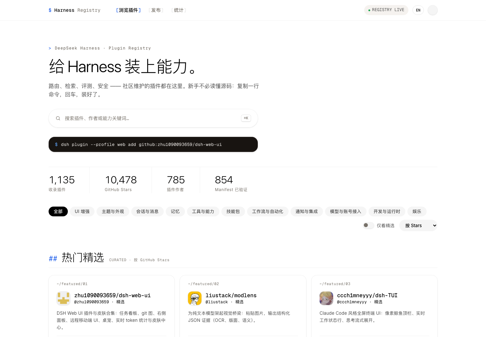

# Harness Registry — DeepSeek Harness Plugin Registry

Harness Registry is a searchable DeepSeek Harness plugin registry for DSH users and plugin authors. It combines a community-curated catalog with GitHub discovery, verifies the installable `dsh.bundle` manifest contract, and exposes comparable plugin metadata and copy-ready install commands.

> Status: pre-release. The registry is available at [majiayu000.github.io/dsh-plugin-registry](https://majiayu000.github.io/dsh-plugin-registry/) and the source is released under the MIT License. See [launch readiness](docs/shipwise-readiness.md).



## Quickstart

Requirements: Node.js 22 and npm.

```bash
git clone https://github.com/majiayu000/dsh-plugin-registry.git
cd dsh-plugin-registry
npm ci
npm run dev
```

Open <http://localhost:5173> to browse, search, filter, and inspect the registry.

## What it provides

- A searchable web directory with categories, trust labels, Stars, Forks, and install commands.
- Curated entries imported from the community registry.
- Automatic discovery from the GitHub `dsh-plugin` topic.
- Manifest verification: discovered repositories must declare a valid `dsh.bundle` object in `package.json`.
- A public JSON snapshot with schema validation, health gates, and a separate audit queue.
- A repository checker that explains whether a plugin is eligible for automatic discovery.

## Query the registry data

The generated snapshot lives at [`public/data/plugins.json`](public/data/plugins.json) and follows [`schema/registry.schema.json`](schema/registry.schema.json).

```bash
jq '.stats | {published, curated, automaticallyDiscovered, pendingReview}' public/data/plugins.json
```

Inspect one plugin:

```bash
jq '.plugins[] | select(.id == "omdsh-dev/dsh-at-file") | {id, trustLevel, install}' public/data/plugins.json
```

Validate the snapshot and run the governance tests:

```bash
npm run validate:registry
npm test
```

Backfill GitHub primary-language metadata without rerunning full discovery:

```bash
GH_TOKEN=... npm run backfill:languages
```

## How discovery works

```text
Curated registry ─┐
                  ├─ normalize ─ verify ─ governance ─ public registry
GitHub topic ─────┘                              └──── audit queue
```

Curated repositories receive the `curated` trust level. Automatically discovered repositories are published only when their root `package.json` contains a valid `dsh.bundle`; these receive `manifest_verified`. Blocked, malformed, and pending repositories are excluded from the installable list. The full policy is documented in [registry governance](docs/registry-governance.md).

The scheduled GitHub Actions workflow refreshes the snapshot every two hours. When the registry changes, the same workflow commits the snapshot and deploys its verified build artifact to GitHub Pages, so sync commits created with `GITHUB_TOKEN` do not depend on a second `push` event. A health gate prevents an unauthenticated partial discovery run or an unexpectedly smaller complete snapshot from replacing healthy data.

## Add a plugin

For automatic discovery:

1. Publish a real, public, non-fork GitHub repository.
2. Declare an installable `dsh.bundle` object in the root `package.json`.
3. Add the `dsh-plugin` GitHub topic.
4. Wait for the next registry sync.

Use the local repository checker at <http://localhost:5173/publish.html> before requesting a registry correction.

## Known limitations

- Manifest verification confirms the package shape; it is not a security audit or endorsement of plugin code.
- Stars, Forks, descriptions, Topics, and primary languages are point-in-time GitHub metadata and can lag until the next sync.
- A complete discovery refresh requires a GitHub token; unauthenticated runs inspect only recent candidates and cannot overwrite a complete snapshot.
- The browser-based repository checker uses the unauthenticated GitHub API and may encounter rate limits.
- The GitHub Pages site tracks `main`; formal versioned releases are not yet available.

## Development

```bash
npm ci
npm test
npm run validate:registry
npm run build
```

To refresh registry data, provide a GitHub token with public repository read access:

```bash
GITHUB_TOKEN=... npm run sync:plugins
```

Do not commit tokens or generated credentials. See [CONTRIBUTING.md](CONTRIBUTING.md) for the change workflow.

### Project structure

- `assets/` contains the registry UI modules, styles, and translations.
- `public/data/plugins.json` is the generated public registry snapshot.
- `scripts/` contains discovery, normalization, and validation tooling.
- `schema/registry.schema.json` defines the published snapshot contract.
- `tests/` covers registry governance and browser-facing behavior.

## Support and security

- Bugs, data corrections, and feature requests: [GitHub Issues](https://github.com/majiayu000/dsh-plugin-registry/issues)
- Sensitive vulnerabilities: [private vulnerability report](https://github.com/majiayu000/dsh-plugin-registry/security/advisories/new)
- Security policy: [SECURITY.md](SECURITY.md)

## License

Harness Registry is available under the [MIT License](LICENSE).
